# Plan de Integración Multi-Repo con IA (Kotlin Android)

## 🎯 Objetivo
Validar automáticamente que cambios en el repo principal no rompan los sub-repos de cada país en proyectos Kotlin Android.

---

## 📁 Arquitectura de Repos

```
repo-principal/
├── shared-components/
│   ├── src/main/kotlin/
│   └── build.gradle.kts
├── shared-models/
│   ├── src/main/kotlin/
│   └── build.gradle.kts
├── shared-screens/
│   ├── src/main/kotlin/
│   └── build.gradle.kts
└── .github/workflows/

repo-pais-A/  (Android app - depende de repo-principal)
repo-pais-B/  (Android app - depende de repo-principal)
repo-pais-C/  (Android app - depende de repo-principal)
```

---

## 🔧 Componentes Necesarios

### 1. **Gestión de Dependencias entre Repos**

**Opción A: Git Submodules**
```bash
# En cada sub-repo
git submodule add https://github.com/org/repo-principal shared-core
```
```kotlin
// settings.gradle.kts
include(":shared-core:shared-components")
include(":shared-core:shared-models")
```
- ✅ Simple para empezar
- ❌ Requiere commits explícitos para actualizar
- ❌ Difícil gestión de versiones

**Opción B: Maven/GitHub Packages (RECOMENDADO)**
```kotlin
// build.gradle.kts del repo principal
plugins {
    id("maven-publish")
}

publishing {
    publications {
        create<MavenPublication>("release") {
            groupId = "com.org"
            artifactId = "shared-core"
            version = "1.2.3"
            from(components["release"])
        }
    }
    repositories {
        maven {
            name = "GitHubPackages"
            url = uri("https://maven.pkg.github.com/org/repo-principal")
            credentials {
                username = System.getenv("GITHUB_ACTOR")
                password = System.getenv("GITHUB_TOKEN")
            }
        }
    }
}
```

```kotlin
// build.gradle.kts en sub-repos
dependencies {
    implementation("com.org:shared-core:1.2.3")
}
```
- ✅ Versionado semántico
- ✅ Control fino de versiones
- ✅ Fácil rollback
- ✅ Cache de dependencias

**Opción C: JitPack.io (Más simple)**
```kotlin
// settings.gradle.kts
dependencyResolutionManagement {
    repositories {
        maven { url = uri("https://jitpack.io") }
    }
}

// build.gradle.kts
dependencies {
    implementation("com.github.org:repo-principal:1.2.3")
}
```
- ✅ Sin configuración de tokens
- ✅ Builds automáticos desde GitHub releases
- ✅ Gratis para repos públicos

**Opción D: Monorepo con Gradle Composite Builds**
- Un solo repo con módulos separados
- Menos problemas de sincronización

---

### 2. **Pipeline de Validación (GitHub Actions)**

**Archivo: `.github/workflows/validate-pr.yml` en repo principal**

```yaml
name: Validate Breaking Changes Android

on:
  pull_request:
    branches: [main]

jobs:
  build-main-repo:
    runs-on: ubuntu-latest
    steps:
      - uses: actions/checkout@v3

      - name: Set up JDK 17
        uses: actions/setup-java@v3
        with:
          java-version: '17'
          distribution: 'temurin'

      - name: Setup Gradle
        uses: gradle/gradle-build-action@v2

      - name: Build shared modules
        run: ./gradlew assembleRelease

      - name: Publish to local maven
        run: ./gradlew publishToMavenLocal

      - name: Upload artifacts
        uses: actions/upload-artifact@v3
        with:
          name: shared-libs
          path: ~/.m2/repository/com/org/shared-core/

  test-country-repos:
    needs: build-main-repo
    strategy:
      matrix:
        repo: [repo-pais-A, repo-pais-B, repo-pais-C]
      fail-fast: false  # Continuar aunque falle uno
    runs-on: ubuntu-latest
    steps:
      - name: Checkout country repo
        uses: actions/checkout@v3
        with:
          repository: org/${{ matrix.repo }}
          token: ${{ secrets.PAT_TOKEN }}

      - name: Set up JDK 17
        uses: actions/setup-java@v3
        with:
          java-version: '17'
          distribution: 'temurin'

      - name: Download shared libs
        uses: actions/download-artifact@v3
        with:
          name: shared-libs
          path: ~/.m2/repository/com/org/shared-core/

      - name: Update dependency to snapshot
        run: |
          # Reemplazar versión con SNAPSHOT local
          sed -i 's/implementation("com.org:shared-core:[^"]*")/implementation("com.org:shared-core:SNAPSHOT")/' app/build.gradle.kts

      - name: Setup Gradle
        uses: gradle/gradle-build-action@v2

      - name: Run Lint
        run: ./gradlew lint
        continue-on-error: true

      - name: Run Unit Tests
        run: ./gradlew test
        continue-on-error: true

      - name: Build APK
        id: build
        run: ./gradlew assembleDebug
        continue-on-error: true

      - name: Report status
        if: steps.build.outcome == 'failure'
        uses: actions/github-script@v6
        with:
          script: |
            github.rest.issues.createComment({
              issue_number: context.issue.number,
              owner: context.repo.owner,
              repo: context.repo.repo,
              body: '❌ **Breaking change detected in `${{ matrix.repo }}`**\n\nLa build falló al integrar los cambios del repo principal.'
            })

      - name: Upload build logs
        if: failure()
        uses: actions/upload-artifact@v3
        with:
          name: build-logs-${{ matrix.repo }}
          path: |
            **/build/reports/
            **/build/outputs/logs/
```

---

### 3. **Integración con Devin (o Claude/IA)**

**Archivo: `.github/workflows/ai-review.yml`**

```yaml
name: AI Code Review Kotlin

on:
  pull_request:
    branches: [main]

jobs:
  devin-review:
    runs-on: ubuntu-latest
    steps:
      - uses: actions/checkout@v3
        with:
          fetch-depth: 0

      - name: Get PR diff (only Kotlin files)
        id: diff
        run: |
          git diff origin/main...HEAD -- '*.kt' '*.kts' > pr_changes.diff

      - name: Extract changed data classes
        run: |
          # Buscar data classes modificadas
          grep -E "data class|sealed class|interface" pr_changes.diff > changed_models.txt || true

      - name: Analyze with Devin API
        env:
          DEVIN_API_KEY: ${{ secrets.DEVIN_API_KEY }}
        run: |
          curl -X POST https://api.devin.ai/analyze \
            -H "Authorization: Bearer $DEVIN_API_KEY" \
            -H "Content-Type: application/json" \
            -d '{
              "diff": "'"$(cat pr_changes.diff | base64)"'",
              "language": "kotlin",
              "prompt": "Analiza estos cambios en código Kotlin Android. Identifica:\n1. Data classes con propiedades añadidas sin valor por defecto\n2. Cambios en el orden de parámetros de constructores\n3. Sealed classes con nuevas subclases\n4. Funciones extension modificadas\n5. Composables con cambios en parámetros\n6. ViewModels con cambios en StateFlow/LiveData\n\nPara cada breaking change, indica:\n- Archivo y línea\n- Tipo de cambio\n- Impacto potencial en repos dependientes\n- Sugerencia de migración"
            }' \
            -o analysis.json

      - name: Comment results
        uses: actions/github-script@v6
        with:
          script: |
            const fs = require('fs');
            const analysis = JSON.parse(fs.readFileSync('analysis.json'));

            const comment = `## 🤖 Devin AI Analysis - Kotlin Breaking Changes

            ${analysis.response}

            ### 📋 Validation Status
            Los sub-repos están siendo validados automáticamente. Revisa los checks de CI.
            `;

            github.rest.issues.createComment({
              issue_number: context.issue.number,
              owner: context.repo.owner,
              repo: context.repo.repo,
              body: comment
            })
```

---

### 4. **Validación de Data Classes Kotlin**

**Herramienta: Kotlin PSI + Detekt Custom Rules**

```kotlin
// scripts/validate-data-classes.main.kts
import java.io.File

data class DataClassInfo(
    val name: String,
    val properties: List<PropertyInfo>
)

data class PropertyInfo(
    val name: String,
    val type: String,
    val hasDefault: Boolean,
    val position: Int
)

fun analyzeDataClass(content: String): List<DataClassInfo> {
    val dataClassRegex = """data class (\w+)\s*\((.*?)\)""".toRegex(RegexOption.DOT_MATCHES_ALL)
    val propertyRegex = """(?:val|var)\s+(\w+):\s*([^,=\)]+)(?:\s*=\s*([^,\)]+))?""".toRegex()

    return dataClassRegex.findAll(content).map { match ->
        val className = match.groupValues[1]
        val params = match.groupValues[2]

        val properties = propertyRegex.findAll(params).mapIndexed { index, propMatch ->
            PropertyInfo(
                name = propMatch.groupValues[1],
                type = propMatch.groupValues[2].trim(),
                hasDefault = propMatch.groupValues[3].isNotEmpty(),
                position = index
            )
        }.toList()

        DataClassInfo(className, properties)
    }.toList()
}

// Comparar versiones
fun detectBreakingChanges(old: DataClassInfo, new: DataClassInfo): List<String> {
    val issues = mutableListOf<String>()

    // Propiedad añadida sin default
    new.properties.forEachIndexed { index, newProp ->
        val oldProp = old.properties.getOrNull(index)
        if (oldProp?.name != newProp.name && !newProp.hasDefault) {
            issues.add("❌ Propiedad '${newProp.name}' añadida en posición $index sin valor por defecto")
        }
    }

    // Cambio de orden
    old.properties.forEachIndexed { index, oldProp ->
        val newIndex = new.properties.indexOfFirst { it.name == oldProp.name }
        if (newIndex != -1 && newIndex != index) {
            issues.add("⚠️ Propiedad '${oldProp.name}' cambió de posición $index a $newIndex")
        }
    }

    return issues
}

// Uso
val oldFile = File("old/UserModel.kt").readText()
val newFile = File("new/UserModel.kt").readText()

val oldClasses = analyzeDataClass(oldFile)
val newClasses = analyzeDataClass(newFile)

oldClasses.zip(newClasses).forEach { (old, new) ->
    println("Analizando: ${new.name}")
    detectBreakingChanges(old, new).forEach(::println)
}
```

**Reglas de Breaking Changes en Kotlin:**
- ✅ Agregar propiedad con valor por defecto: SAFE
  ```kotlin
  data class User(val id: String, val name: String, val age: Int = 0)
  ```
- ❌ Agregar propiedad sin default en medio: BREAKING
  ```kotlin
  // ANTES
  data class User(val id: String, val name: String)
  // DESPUÉS
  data class User(val id: String, val age: Int, val name: String) // ❌
  ```
- ✅ Agregar propiedad al final sin default: SAFE si usas named arguments
  ```kotlin
  data class User(val id: String, val name: String, val age: Int)
  // Uso: User(id = "1", name = "Juan") // ❌ falla
  ```
- ❌ Cambiar tipo de propiedad: BREAKING
- ❌ Eliminar propiedad: BREAKING
- ✅ Cambiar propiedad `var` a `val`: SAFE (más restrictivo)
- ❌ Cambiar propiedad `val` a `var`: BREAKING (menos restrictivo)

---

### 5. **Ejemplo de Breaking Change Detection en Kotlin**

```kotlin
// ========================================
// REPO PRINCIPAL - ANTES
// ========================================
// shared-models/src/main/kotlin/com/org/models/UserModel.kt
data class UserModel(
    val id: String,
    val name: String,
    val email: String
)

// ========================================
// REPO PAÍS A - USO ACTUAL
// ========================================
// Sin named arguments (PELIGROSO)
val user = UserModel("123", "Juan", "juan@example.com")

// Con named arguments (SEGURO)
val userSafe = UserModel(
    id = "123",
    name = "Juan",
    email = "juan@example.com"
)

// ========================================
// PR PROPUESTO - CAMBIO BREAKING
// ========================================
data class UserModel(
    val id: String,
    val name: String,
    val age: Int,  // ❌ BREAKING: nueva prop sin default en medio
    val email: String
)

// RESULTADO:
// - Sin named args: compila pero con valores incorrectos!! 😱
//   UserModel("123", "Juan", "juan@example.com")
//   -> age = "juan@example.com" (error de tipo)
//
// - Con named args: error de compilación ✅
//   Error: No value passed for parameter 'age'

// ========================================
// SOLUCIONES SEGURAS
// ========================================

// Opción 1: Default value al final
data class UserModel(
    val id: String,
    val name: String,
    val email: String,
    val age: Int = 0  // ✅ SAFE
)

// Opción 2: Nullable al final
data class UserModel(
    val id: String,
    val name: String,
    val email: String,
    val age: Int? = null  // ✅ SAFE
)

// Opción 3: Nueva versión del modelo (mejor para grandes cambios)
data class UserModelV2(
    val id: String,
    val name: String,
    val email: String,
    val age: Int,
    val premium: Boolean = false
)

// Opción 4: Builder pattern
data class UserModel private constructor(
    val id: String,
    val name: String,
    val email: String,
    val age: Int?
) {
    data class Builder(
        var id: String = "",
        var name: String = "",
        var email: String = "",
        var age: Int? = null
    ) {
        fun build() = UserModel(id, name, email, age)
    }
}
```

**Casos comunes de Breaking Changes:**

```kotlin
// ❌ CASO 1: Cambiar sealed class
sealed class Result {
    data class Success(val data: String) : Result()
    data class Error(val message: String) : Result()
}
// Si añades: data class Loading : Result()
// Rompe los `when` exhaustivos en sub-repos

// ❌ CASO 2: Cambiar signature de @Composable
@Composable
fun UserCard(user: UserModel) { ... }
// Si cambias a: fun UserCard(user: UserModel, showAge: Boolean)
// Rompe todas las llamadas

// ❌ CASO 3: Cambiar extension function
fun String.toUserModel(): UserModel { ... }
// Si cambias a: fun String.toUserModel(includeAge: Boolean): UserModel
// Rompe todas las llamadas

// ✅ SOLUCIÓN: Default parameters
@Composable
fun UserCard(
    user: UserModel,
    showAge: Boolean = false  // Safe!
)
```

---

## 🛠️ Stack Tecnológico Recomendado

| Componente | Tecnología |
|------------|------------|
| Lenguaje | Kotlin 1.9+ |
| Build System | Gradle 8+ con Kotlin DSL |
| Dependency Mgmt | Maven/GitHub Packages o JitPack |
| CI/CD | GitHub Actions |
| IA Review | Devin / Claude API / OpenAI |
| Static Analysis | Detekt + Custom Rules |
| Binary Compat | Kotlin Binary Validator |
| Testing | JUnit 5 + MockK |
| Versioning | Semantic Versioning |
| Android | Compose + Material3 |

---

## 📋 Checklist de Implementación

### Fase 1: Setup básico
- [ ] Configurar repo principal como Android Library Module
- [ ] Configurar publicación a Maven (GitHub Packages o JitPack)
- [ ] Configurar sub-repos para consumir el shared module
- [ ] Configurar PAT tokens para acceso cross-repo
- [ ] Crear versión 1.0.0 inicial y tag en Git

### Fase 2: Validación automatizada
- [ ] Implementar workflow que compile cada sub-repo
- [ ] Agregar tests unitarios (JUnit + MockK)
- [ ] Configurar Detekt con reglas custom
- [ ] Configurar Binary Compatibility Validator
- [ ] Configurar reporte de errores en PRs

### Fase 3: IA Integration
- [ ] Integrar Devin/Claude API
- [ ] Crear prompts específicos para Kotlin
- [ ] Implementar análisis de data classes
- [ ] Detectar cambios en @Composables
- [ ] Validar sealed classes
- [ ] Implementar análisis de diff automático

### Fase 4: Refinamiento
- [ ] Agregar análisis estático con Kotlin PSI
- [ ] Implementar reglas custom de breaking changes
- [ ] Dashboard de salud de integraciones
- [ ] Documentar convenciones (named arguments, defaults)

---

## 💰 Costos Estimados

- **GitHub Actions**: ~$0 (free tier suficiente para pruebas)
- **Devin API**: Variable según uso (consultar pricing)
- **Alternativa**: Claude API ~$0.01 por análisis
- **Total mensual**: < $50 para proyecto pequeño/mediano

---

## 🚀 Quick Start

```bash
# ========================================
# 1. REPO PRINCIPAL - Setup
# ========================================
cd repo-principal

# Crear estructura
mkdir -p shared-models/src/main/kotlin/com/org/models
mkdir -p shared-components/src/main/kotlin/com/org/components

# build.gradle.kts (root)
cat > build.gradle.kts << 'EOF'
plugins {
    id("com.android.library") version "8.2.0" apply false
    id("org.jetbrains.kotlin.android") version "1.9.20" apply false
    id("maven-publish")
}
EOF

# shared-models/build.gradle.kts
cat > shared-models/build.gradle.kts << 'EOF'
plugins {
    id("com.android.library")
    id("org.jetbrains.kotlin.android")
    id("maven-publish")
}

android {
    namespace = "com.org.models"
    compileSdk = 34
}

dependencies {
    implementation("org.jetbrains.kotlin:kotlin-stdlib:1.9.20")
}

afterEvaluate {
    publishing {
        publications {
            create<MavenPublication>("release") {
                from(components["release"])
                groupId = "com.org"
                artifactId = "shared-models"
                version = "1.0.0"
            }
        }
    }
}
EOF

# Crear ejemplo de modelo
cat > shared-models/src/main/kotlin/com/org/models/UserModel.kt << 'EOF'
package com.org.models

data class UserModel(
    val id: String,
    val name: String,
    val email: String
)
EOF

# Build y publicar localmente
./gradlew :shared-models:publishToMavenLocal

# ========================================
# 2. SUB-REPOS - Configuración
# ========================================
cd ../repo-pais-A

# settings.gradle.kts
cat >> settings.gradle.kts << 'EOF'
dependencyResolutionManagement {
    repositories {
        google()
        mavenCentral()
        mavenLocal()  // Para testing
        // Para producción:
        maven {
            url = uri("https://maven.pkg.github.com/org/repo-principal")
            credentials {
                username = providers.gradleProperty("gpr.user").orNull
                password = providers.gradleProperty("gpr.token").orNull
            }
        }
    }
}
EOF

# app/build.gradle.kts
cat >> app/build.gradle.kts << 'EOF'
dependencies {
    implementation("com.org:shared-models:1.0.0")
}
EOF

# ========================================
# 3. GITHUB ACTIONS
# ========================================
cd ../repo-principal
mkdir -p .github/workflows

# Copiar validate-pr.yml (del documento anterior)
curl -o .github/workflows/validate-pr.yml https://...

# ========================================
# 4. TEST LOCAL
# ========================================

# En repo principal: hacer un cambio breaking
cat > shared-models/src/main/kotlin/com/org/models/UserModel.kt << 'EOF'
package com.org.models

data class UserModel(
    val id: String,
    val age: Int,  // Sin default!
    val name: String,
    val email: String
)
EOF

# Publicar nueva versión
./gradlew :shared-models:publishToMavenLocal -Pversion=1.1.0-SNAPSHOT

# En sub-repo: intentar compilar
cd ../repo-pais-A
# Actualizar versión en build.gradle.kts a 1.1.0-SNAPSHOT
./gradlew assembleDebug
# -> DEBERÍA FALLAR si no usan named arguments
```

---

## 📚 Recursos Adicionales

- [GitHub Actions: Multi-repo workflows](https://docs.github.com/en/actions)
- [Devin API Docs](https://devin.ai/docs)
- [Kotlin Binary Compatibility Validator](https://github.com/Kotlin/binary-compatibility-validator)
- [Publishing Android Libraries](https://developer.android.com/studio/build/maven-publish-plugin)
- [JitPack - Publish Libraries](https://jitpack.io/docs/)
- [Detekt - Custom Rules](https://detekt.dev/docs/introduction/custom-rules/)
- [Semantic Versioning](https://semver.org/)
- [Kotlin Coding Conventions](https://kotlinlang.org/docs/coding-conventions.html)

---

## ⚠️ Consideraciones Importantes

1. **PAT Tokens**: Necesitas Personal Access Tokens con permisos `repo` y `write:packages` para acceder a sub-repos privados y publicar en GitHub Packages

2. **Caché de Gradle**: Configurar caché para acelerar builds
   ```yaml
   - uses: gradle/gradle-build-action@v2
     with:
       cache-read-only: false
   ```

3. **Paralelización**: Los 3 sub-repos se validan en paralelo con `strategy.matrix`

4. **Rate limits**:
   - GitHub API: 5000 requests/hora con token
   - Devin API: según tu plan
   - Gradle downloads: usar repositorios espejo si es necesario

5. **Secrets**: Configurar en Settings > Secrets
   - `PAT_TOKEN`: Para acceso cross-repo
   - `DEVIN_API_KEY`: Para análisis con IA
   - `GPR_TOKEN`: Para GitHub Packages (puede ser el mismo PAT)

6. **Named Arguments**: OBLIGATORIO en sub-repos para evitar errores silenciosos
   ```kotlin
   // Configura Detekt para forzar named arguments
   // detekt.yml
   style:
     ForbiddenMethodCall:
       active: true
   ```

7. **Versionado Semántico Estricto**:
   - MAJOR: Breaking changes (eliminar props, cambiar tipos)
   - MINOR: Features nuevas con defaults
   - PATCH: Bug fixes sin cambios en API

8. **Build Time**: Cada validación puede tardar 5-10 min. Optimizar con:
   - Gradle Build Cache
   - Dependency caching
   - Incremental builds
   - Solo compilar módulos afectados

9. **False Positives**: La IA puede reportar falsos positivos. Validar siempre con build real.

10. **Documentación**: Mantener CHANGELOG.md con breaking changes explicados

---

## 📞 Siguiente Paso

**Prueba de concepto recomendada:**

```bash
# 1. Crear branch de prueba
cd repo-principal
git checkout -b test/breaking-change

# 2. Modificar un modelo (breaking change intencional)
# Editar shared-models/src/main/kotlin/com/org/models/UserModel.kt
data class UserModel(
    val id: String,
    val name: String,
    val age: Int,  // Nueva prop sin default
    val email: String
)

# 3. Commit y push
git add .
git commit -m "test: add age field without default"
git push origin test/breaking-change

# 4. Crear PR en GitHub
gh pr create --title "Test: Breaking Change Detection" \
  --body "Testing automated validation"

# 5. Observar:
# - Workflow validate-pr.yml se ejecuta automáticamente
# - Compila repo principal
# - Intenta compilar los 3 sub-repos
# - Devin/Claude analiza el diff
# - Comentarios automáticos en la PR

# 6. Revisar resultados:
# - ¿Qué sub-repos fallaron?
# - ¿El análisis de IA fue preciso?
# - ¿Se detectó el breaking change correctamente?

# 7. Iterar:
# - Ajustar prompts de IA
# - Afinar reglas de Detekt
# - Mejorar mensajes de error
```

---

## 🎯 Resultado Esperado

Al crear una PR con breaking changes, deberías ver:

1. ✅ **Build del repo principal**: Exitoso
2. ❌ **Build de repo-pais-A**: Falla (si usa el modelo sin named args)
3. ❌ **Build de repo-pais-B**: Falla
4. ✅ **Build de repo-pais-C**: Exitoso (si usa named args o no usa ese modelo)
5. 🤖 **Comentario de Devin**:
   ```
   Breaking change detected:
   - File: shared-models/UserModel.kt
   - Change: Added required parameter 'age' at position 2
   - Impact: HIGH - Will break all instantiations without named arguments
   - Suggestion: Add default value or make nullable
   ```

---

## 🔄 Workflow Completo

```mermaid
graph TD
    A[Developer crea PR] --> B[GitHub Actions triggered]
    B --> C[Build repo principal]
    C --> D[Publicar a Maven local]
    D --> E[Validar 3 sub-repos en paralelo]
    E --> F{Alguno falla?}
    F -->|Sí| G[Comentario de error en PR]
    F -->|No| H[✅ Checks passed]
    B --> I[Devin analiza diff]
    I --> J[Comentario con análisis]
    G --> K[Developer revisa]
    J --> K
    K --> L[Fix o merge]
```



---

## 🎬 PROMPT PARA CREAR EL REPO PRINCIPAL

**Copia y pega esto para crear el repo principal completo:**

```
Necesito crear un repositorio Android con módulos compartidos (shared-core) que será consumido por otros repos. Créame la siguiente estructura:

ESTRUCTURA DEL PROYECTO:
- repo-principal/ (Android Library)
  - shared-models/ (módulo de modelos de datos)
  - shared-components/ (módulo de componentes UI reutilizables)
  - shared-screens/ (módulo de pantallas base)
  - .github/workflows/ (CI/CD)

REQUISITOS TÉCNICOS:
- Kotlin 1.9.20+
- Gradle 8.2+ con Kotlin DSL
- Android SDK 34
- Jetpack Compose
- Publicación a Maven (GitHub Packages)
- Versionado semántico (empezar en 1.0.0)

CONTENIDO DE CADA MÓDULO:

1. SHARED-MODELS:
   - UserModel: data class con id, name, email
   - AuthState: sealed class (Authenticated, Unauthenticated, Loading)
   - ApiResponse: sealed class genérica para respuestas de API

2. SHARED-COMPONENTS:
   - CustomButton: @Composable con loading state
   - CustomTextField: @Composable con validación
   - LoadingIndicator: @Composable

3. SHARED-SCREENS:
   - BaseScreen: @Composable con estructura común (toolbar, bottom bar, etc)
   - SplashScreen: @Composable simple

CONFIGURACIÓN BUILD:
- Cada módulo debe tener su build.gradle.kts
- Configurar maven-publish plugin
- GroupId: com.org
- ArtifactIds: shared-models, shared-components, shared-screens
- Version: 1.0.0

GITHUB ACTIONS:
Crear 2 workflows:

1. validate-pr.yml:
   - Trigger en PRs a main
   - Compilar todos los módulos
   - Publicar a mavenLocal
   - Subir artifacts
   - Checkout y validar los 3 sub-repos (repo-pais-A, repo-pais-B, repo-pais-C)
   - Reportar errores en comentarios de PR

2. ai-review.yml:
   - Trigger en PRs a main
   - Extraer diff de archivos .kt
   - Analizar con Devin/Claude API
   - Detectar breaking changes en data classes, sealed classes, @Composables
   - Comentar resultados en PR

ARCHIVOS ADICIONALES:
- README.md: Explicar cómo consumir este repo
- CHANGELOG.md: Template para documentar cambios
- gradle.properties: Configuración de publicación
- .gitignore: Android/Gradle standard
- detekt.yml: Configuración de Detekt con reglas custom para forzar named arguments
- settings.gradle.kts: Incluir los 3 módulos

CONVENCIONES DE CÓDIGO:
- SIEMPRE usar named arguments en data classes
- Nuevas propiedades SIEMPRE con valores por defecto o al final
- Documentar breaking changes en CHANGELOG
- Tests unitarios para cada modelo

SCRIPTS ÚTILES:
- scripts/validate-data-classes.main.kts: Script para detectar breaking changes localmente
- scripts/publish-local.sh: Script para publicar todos los módulos a mavenLocal
- scripts/bump-version.sh: Script para incrementar versión

Crea todo el proyecto con archivos completos y funcionales. Usa las mejores prácticas de Android y Kotlin.
```

---

## 🎬 PROMPT ALTERNATIVO (MÁS ESPECÍFICO)

**Si quieres más control paso a paso:**

```
Voy a crear un repositorio Android modular. Ayúdame paso por paso:

PASO 1 - ESTRUCTURA BASE:
Crea la estructura de carpetas para un proyecto Android con 3 módulos (shared-models, shared-components, shared-screens). Genera:
- settings.gradle.kts (root)
- build.gradle.kts (root)
- gradle.properties
- .gitignore

PASO 2 - MÓDULO SHARED-MODELS:
Crea el módulo shared-models con:
- build.gradle.kts configurado como Android Library
- Plugin maven-publish configurado
- Estos modelos de ejemplo:
  * UserModel (data class: id, name, email)
  * AuthState (sealed class: Authenticated, Unauthenticated, Loading)
  * ApiResponse<T> (sealed class genérica: Success, Error, Loading)

PASO 3 - MÓDULO SHARED-COMPONENTS:
Crea el módulo shared-components con:
- build.gradle.kts con dependencia de Compose
- Estos componentes:
  * CustomButton (con loading state)
  * CustomTextField (con validación)
  * LoadingIndicator

PASO 4 - MÓDULO SHARED-SCREENS:
Crea el módulo shared-screens con:
- build.gradle.kts con dependencias de Navigation Compose
- Dependencia de shared-components
- BaseScreen composable con estructura común

PASO 5 - GITHUB ACTIONS:
Crea .github/workflows/validate-pr.yml que:
- Se ejecute en PRs a main
- Compile todos los módulos
- Publique a mavenLocal
- Valide 3 repos externos (repo-pais-A, repo-pais-B, repo-pais-C)
- Comente errores en la PR

PASO 6 - AI INTEGRATION:
Crea .github/workflows/ai-review.yml que:
- Extraiga diff de archivos Kotlin
- Llame a Devin API con prompt específico para detectar breaking changes
- Comente análisis en la PR

PASO 7 - DOCUMENTACIÓN:
Crea README.md con:
- Cómo instalar estas librerías en otros proyectos
- Cómo publicar nuevas versiones
- Reglas de breaking changes
- Ejemplos de uso

PASO 8 - SCRIPTS:
Crea scripts/validate-data-classes.main.kts que analice cambios en data classes comparando dos versiones.

Ve paso por paso. Después de cada paso espera mi confirmación antes de continuar.
```

---

## 🚀 COMANDO RÁPIDO PARA INICIALIZAR

**Si prefieres comandos directos:**

```bash
# Crear directorio y entrar
mkdir repo-principal && cd repo-principal

# Inicializar git
git init
git branch -M main

# Usar el prompt con Devin o Claude:
# "Lee el archivo multi-repo-integration-plan.md, sección 'PROMPT PARA CREAR EL REPO PRINCIPAL'
# y créame todo el proyecto siguiendo esas especificaciones"
```